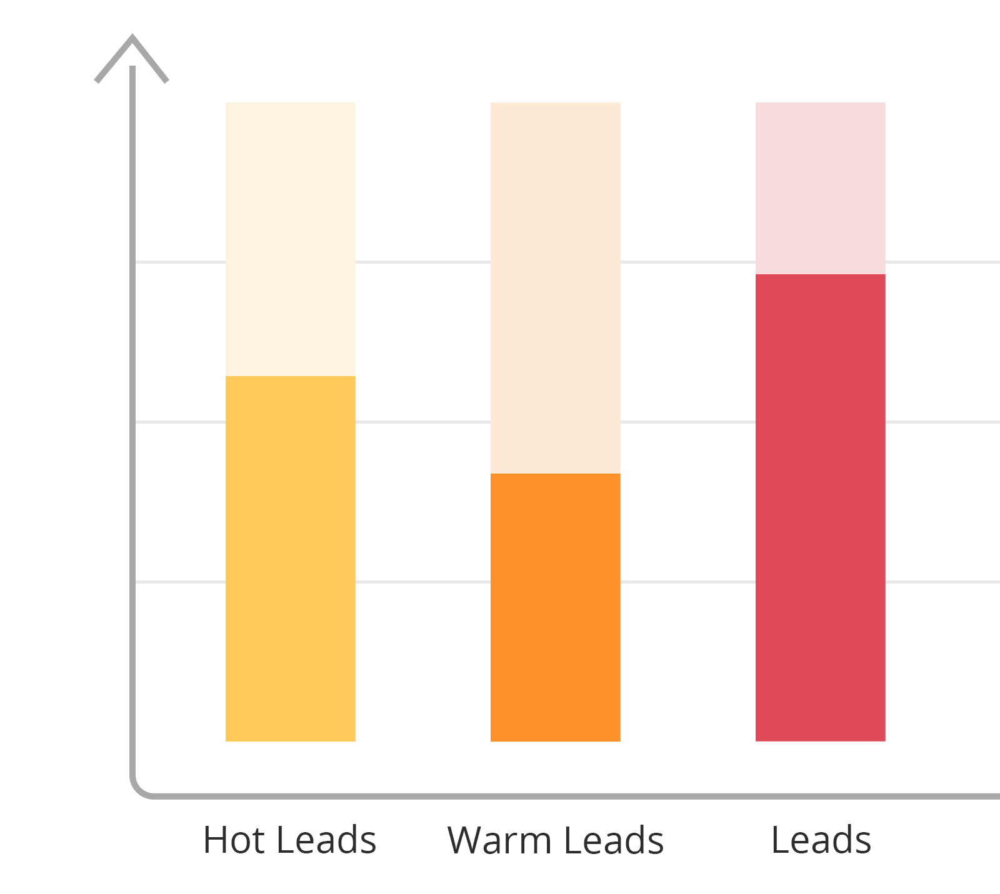

# AI & Machine Learning For Predictive Lead Scoring

### Predictive Lead Scoring does all the hard work for you
Predictive analytics with Machine Learning can provide your sales and marketing team with in-depth customer knowledge and ways to target the hottest and most qualified leads – resulting in saved time and higher revenue streams.

* This can be used to augment my other project: [Identifying New Customers Using Machine Learning for B2B-sales](https://github.com/joehoeller/Identifying-New-Customers-Using-Machine-Learning-for-B2B-sales) (Please note that this link to the left is no longer avail as it's a proprietary product that requires lisc'ing, please contact me at joehoeller@gmail.com for details).

### How can machine learning assist the sales cycle?
Machine learning allows you to ‘train’ algorithms to make accurate predictions about new customers or current but unknown customers using verified customer data. A machine-learning algorithm runs through a database of customer data and establishes trends, recognized patterns and builds a model from the data, in order to create a prediction model.

Applying the prediction model to new data sets will enable B2B sales teams to benefit from automatic alerts to the propensity of a customer purchasing a given product. At this point, they can decide to make unique offers to that customer to encourage sales.

It’s not just about knowing when to offer incentives or discounts. The B2B sales process, particularly for businesses whose product is low volume and high margin, is often highly consultative and involves tailoring the solution to each client. Invariably, it takes large amounts of time to properly follow up on a lead, and if these leads are unlikely to purchase, lots of time and money could be wasted. By applying accurate propensity models to establish which leads are the most likely to purchase, you can focus your sales team’s time on those prospects.

### How much data is required?
To be effective, machine learning for predictive analytics requires reasonable amounts of historical data. Without large numbers of test cases, it may be that peripheral factors could have a major outcome of the results. The machine-learning algorithm can only work with the historical data it has, if your data set is too small or inaccurate it may be inferring propensity from non-relevant events. For example … if you had a small set of data on customers who bought a certain product, and one customer mistakenly bought that product when they intended to buy another, the model would extrapolate that propensity to buy and apply it to future customers. In reality these customers would not hold that propensity. Which means to get the most accurate predictions, you need a large data set in order to allow the machine learning algorithm to recognize what the underlying trends in the data are, and what is just noise in the data.

### Steps in the machine learning process
Once the problem is defined, in this case successful lead scoring, data mining is undertaken to discover the patterns in the large data set. 
A training data set is compiled often based on expert knowledge where the labels or scores of these customers are reliably known. The algorithm is applied to this data set in which a number of descriptive features relate to a target feature and a prediction model is created.

This prediction model can then be fed practical query instances (e.g. is this customer likely to convert) and make predictions. These predictions can then influence business strategy. 
These may be done manually or programmatically, depending on the way your businesses systems are configured.

Enterprise-grade data science problem, from business understanding to model evaluation, by applying two different frameworks:

* [CoNVO](https://www.oreilly.com/library/view/thinking-with-data/9781491949757/ch01.html) to scope the problem and formulate a data science solution
* [CRISP-DM](https://en.wikipedia.org/wiki/Cross-industry_standard_process_for_data_mining) to iterate on a model-based solution

Since data and machine learning engineers are typically responsible for deployment, maintenance, and optimization of infrastructure and models, this project omits the Deployment phase of CRISP-DM.

This project is not without flaws - the argument could be stronger, costs and benefits could be more accurate, and the resulting model could perform better, but its level of detail is reflective of the effort required to to create a reproducible data science solution that is (1) well aligned with stakeholder expectations and (2) poised to deliver business value. We could continue to iterate and improve our results ad infinitum in the pursuit of the perfect solution but in the real world, we are constrained by budgets and so by time. It's clear that even if we had unlimited budget to refine the analysis and model, our early and fast efforts will likely be satisfactory enough to deploy a data solution, allowing us to move on and pursue a different project. From both business and engineering perspectives, it's generally best to start with the [simplest thing that could possibly work](http://www.agilenutshell.com/simplest_thing), especially if it's relatively cheap to build.

## Overview
This project uses the Bank Marketing Dataset published to the [UCI Machine Learning Repository](https://archive.ics.uci.edu/ml/datasets/bank+marketing) to demonstrate the scoping and implementation of a real-world data science project. The dataset's description on the UCI Machine Learning website states:

> The classification goal is to predict if the client will subscribe a term deposit (variable y).

With a hypothetical business context and feedback from stakeholders regarding various aspects of a marketing problem, we can arrive at a more complete and operational description of our problem, based on the [CoNVO](https://www.oreilly.com/library/view/thinking-with-data/9781491949757/ch01.html) framework:

### Context
This Portuguese bank offers term deposits as a financial product offering to its existing customers as a means to provide capital for loan products. It is currently running a telemarketing campaign in which existing customers are pitched on the term deposit product during inbound customer service and outbound sales calls. The decision maker for this campaign is the director of marketing.

### Needs
A tactical change in product strategy as a result of changing market conditions (lowered interest rates) requires additional budget resources to jumpstart a new campaign for a different financial product – mortgages. The bank figures that if it can improve its conversion rate with its current campaign, then it will be in a better position to spend the remaining budget more efficiently, leading to higher revenues and more funds available for the mortgage campaign. 

The director of marketing is also interested in quantifying the effect of this modelling effort to ensure that data science efforts are making an impact and, if successful, making it easier to get buy in for allocate resources to data-driven efforts in the future.

### Vision
We propose to create a lead scoring model that will rank customers according to a model score that indicates how likely customers are to invest in a term deposit. By focussing on the customers who are most likely to convert, the bank will earn more per marketing dollar spent on customer specialists who are pitching to customers. To this end, we will deliver a ranked list of contacts in an Excel spreadsheet that the director of marketing can hand off to her management team for operationalization.

Quantifying the impact of the campaign empirically will require the design prior to and execution of a controlled experiment when the campaign is deployed. Two weeks prior to model deployment, we’ll deliver a report outlining the experimental design and two weeks following the conclusion of the campaign, we’ll deliver a report summarizing the results.

### Outcome
Ssignificant increases in ROI typically result of the development and deployment of the lead scoring model, however this code needs integration into the  model of a CRM or existing system. 

## Key Insights

* The conversion rate of the previous marketing campaign was 25%.

* The conversion rate of the current marketing campaign is 11%.

* A simple "domain-driven" model that chooses customers to target based on whether they converted in the last marketing campaign and chooses remaining customers randomly improved the current conversion rate by 250% - bringing the conversion rate of targeted customers to 39%.

* A Naive Bayes model using only categorical features from the original training set improved the baseline conversion rate by 354% - bringing the conversion rate of targeted customers to 51%.

* With the Naive Bayes model, targeting 6.6% of the population identifies ~30% of the respondents.

## Project Structure

### data

The data retrieved from the UCI Machine Learning Repository as well as training and test sets.

* `bank_additional/`
   * [Original dataset and supporting documentation](https://archive.ics.uci.edu/ml/datasets/bank+marketing) retrieved from the UCI Machine Learning Repository on December 1, 2018.

* `train.csv`
   * The dataset used for exploratory analysis to train machine learning models

* `test.csv`
   * The dataset used to evaluate the optimal model

### Models

Serialized model objects with optimized hyperparameters.

* `experiment-1-model.pk`
   * The scikit-learn implementation of Naive Bayes which was the optimal model of the project

### Notebooks

Exploratory analysis and experiment code.

* `1.0-exploratory-analysis.ipynb`
  * Exploratory analysis of existing marketing data

* `2.0-experiment-1-baseline-vs-ml.ipynb`
  * The first experiment designed to evaluate the difference in performance between the baseline domain-driven model and a set of machine learning models

* `3.0-experiment-2-feature-engineering`
  * Prototyping code for new features derived from existing variables included in the marketing dataset

* `3.1-experiment-2-model.ipynb`
  * The second experiment designed to evaluate the effectiveness of derived features with the best performing model from experiment #1

* `4.0-model-evaluation.ipynb`
   * Evaluation of the best performing model on the held-out test set

### Misc

A supporting library that encapsulates ML model objects and provides tools for evaluation and hyperparameter tuning. Most of this code will be moved to a standalone library, except for:

* `experiments/`
   * Code modules for experiment code that includes pipelines and derived features

* `parameters.py`
   * Values for e.g. costs, benefits, and proportion of targeted customers from the Problem Model workbook

## Dependencies

* numpy==1.15.2
* pandas==0.23.4
* matplotlib==2.2.2
* seaborn==0.9.0
* scikit-learn==0.20.0

